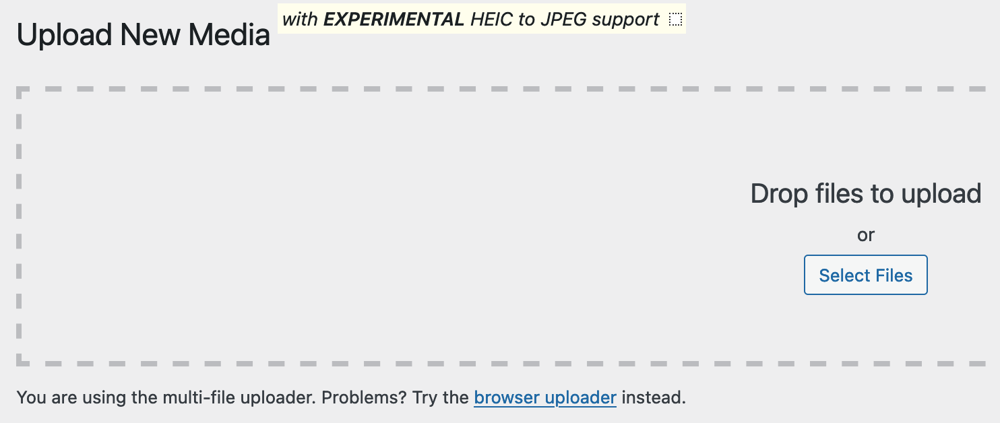
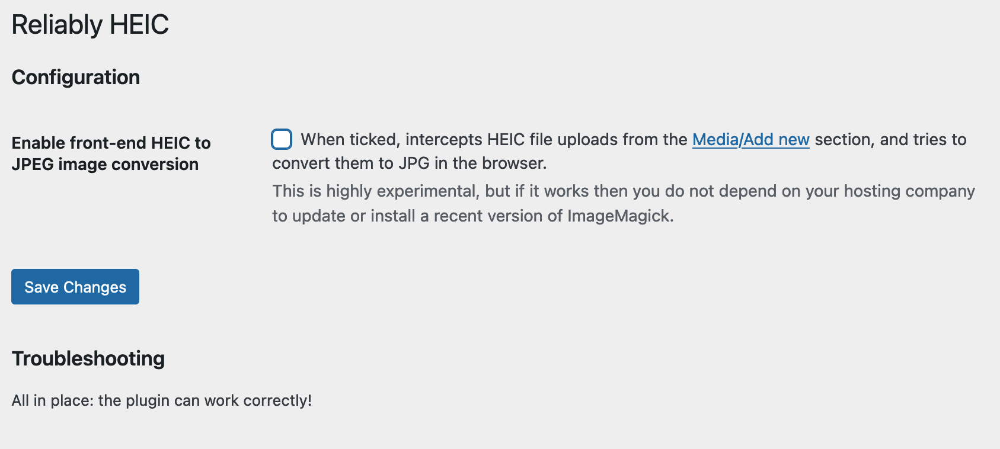
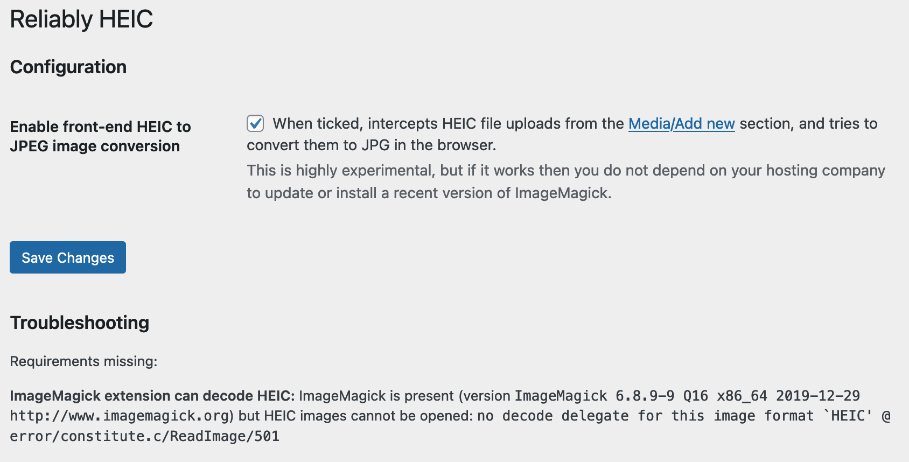

# Reliably HEIC

**A WordPress plug-in to reliably handle HEIC files.**

iPhones save pictures as HEIC. WordPress does not handle these natively, and I was tired of [manually converting images](https://soledadpenades.com/posts/2022/de-heic-ifying-images/) before uploading them to my blog.

I tried other plug-ins but they did not work on my server and did not give me a lot of detail as to why. Also, they did not provide a front-end fallback. Of course, I was itching to see if that could even work.

Thus, this plug-in will try to convert images back-end side. If it does not work, you can enable the front-end fallback, which will do the processing in your browser. Yes.
_Always bet on JavaScript_, etc.

When the front-end fallback is enabled, it will display a little message next to the *Upload new media* heading, like this:



If you don't see that message after installing _and_ activating the plug-in, that means that you haven't enabled that in the plugin settings (it is not enabled by default).


## Installing and configuring

1. Upload to wp-content/plugins.
2. Go to your blog's plugins page.
3. Activate the plug-in from the plugins page.
4. Go to the plugin's settings page, and check that all the requirements are satisfied. If not, read the limitations section below and maybe turn on the front-end experimental fallback (_Enable front-end HEIC to JPEG image conversion_).
5. Upload HEIC files like there's no tomorrow.

## Limitations

### Back-end side

For HEIC images to be processed in the back-end you need an up to date ImageMagick library installed _and_ the corresponding php extension enabled in your server.

Not all hosting providers enable ImageMagick (typically, they provide [libGD](https://www.php.net/manual/en/intro.image.php) which is sufficient in most cases), and not all of them who enable it do also install an up to date version and/or with HEIC/HEIF support.

You can check if the back-end will work by installing the plug-in and then visiting its settings page.

If any requirement is missing, you might want to either try to tinker with your server settings (if it's at all possible--I have some pointers below) or try ticking the `Enable front-end HEIC to JPEG image conversion` option, save changes and then try uploading again.

This is how it looks like if all the requirements are in place:


And when you have an old or malfunctioning version of ImageMagick:


Note the error message at the bottom, and the enabled front-end, as otherwise I can't upload images to that WordPress installation.

### Front-end side

#### Limitation 1: You need a modern browser

Given this was super experimental and using WASM and all sorts of cool modern JavaScript stuff, I did not bother with providing support for ancient browsers like IE. If you want to use the front-end image conversion, please use a modern browser like Firefox.

Also: I only used Firefox 117 to develop this, so if it does not work with Chrome, feel free to fix it and send a PR. (There are only so many hours in the day, sorry not sorry).

#### Limitation 2: it can only intercept uploads to `media-new.php`

There are more details in the source code, but this is due to the way WordPress sets up the interface and file uploader: there's only so much we can intercept.

In other words, this is a bit of a hack, but under the right circumstances, it works.

The good thing is that this front-end method in general does not depend _so much_ on the hosting provider library support, as you end up uploading JPG files to your server.

#### Limitation 3: slower decoding if the server does not configure MIME for WASM

If your server does not have a properly configured MIME type for WASM files, the heif library will print an error to the JavaScript console:

```
 wasm streaming compile failed: TypeError: WebAssembly: Response has unsupported MIME type '' expected 'application/wasm' libheif.js:1:251

 falling back to ArrayBuffer instantiation
```
and then it will be slower than it would be otherwise. The difference can be quite noticeable - from 2 to 12 seconds to decode HEIF images into a canvas in my laptop!

You'll have to tinker with your server if you want to speed this up, or just let it be. It will work, but it will be slower. Although it will probably still be faster than converting pictures manually before uploading...

## How to satisfy the system requirements

### ImageMagick extension present and activated

Uncomment `extension=imagick.so` in `php.ini`.
You probably also need to restart the server.

If you're using MAMP to develop locally, php.ini is in `/Applications/MAMP/bin/php/{the version of php you're using}/conf/php.ini`. The last version of MAMP seems to be shipping an old version of ImageMagick without HEIC support, though.

## Developing and contributing

I have left a fair amount of logging in the most critical parts (mostly around handling the images). I tried to catch the grossest errors and add some helpful logging where possible.

* If you are trying to figure out what's happening in the back-end, look at the `error.log` file or wherever the `error_log()` statements are printed in your system.
* In the front-end, look at the console in your browser's developer tools.

## License

This plug-in is distributed under the terms of the GNU General Public License v3. You can read the [license file](./LICENSE.md).

## Credits

This plugin uses the JavaScript port of [libheif](https://github.com/strukturag/libheif/tree/master) for the client-side decoding of HEIC files. `libheif` is distributed under the terms of the GNU Lesser General Public License.