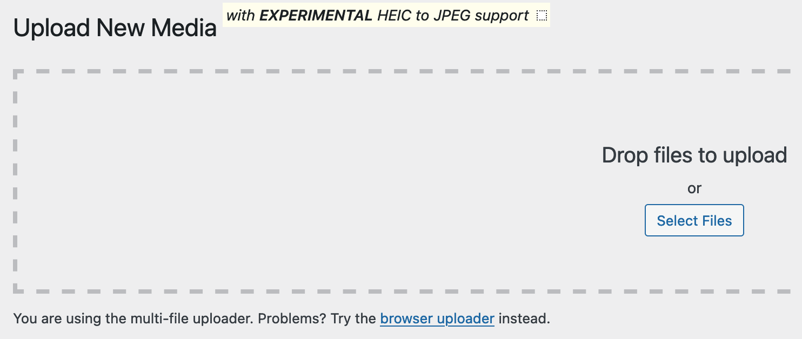
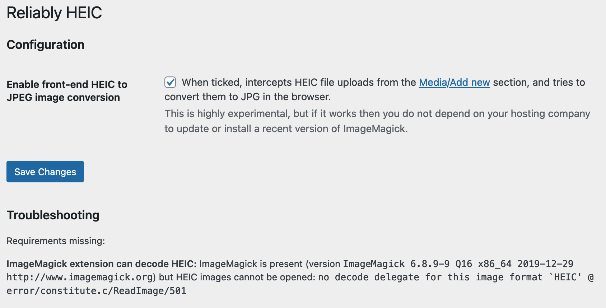

# Reliably HEIC

**A WordPress plug-in to reliably handle HEIC files.**

iPhones save pictures as HEIC. WordPress does not handle these natively, and I was tired of [manually converting images](https://soledadpenades.com/posts/2022/de-heic-ifying-images/) before uploading them to my blog.

I tried other plug-ins but they did not work on my server, and also they did not provide a front-end fallback. And of course I was itching to see if that could even work.

This plug-in will try to convert images back-end side. If it does not work, you can enable the front-end fallback, which will do the processing in your browser. Yes.
_Always bet on JavaScript_, etc.

When the front-end fallback is enabled, it will display a little message next to the *Upload new media* heading, like this:




## Installing and configuring

1. Upload to wp-content/plugins.
2. Go to your blog's plugins page.
3. Activate the plug-in.
4. Go to settings and check that all the requirements are satisfied. If not, read the limitations section below and maybe turn on the front-end experimental processing.
5. Upload HEIC files like there's no tomorrow.

## Limitations

### Front-end side

#### Limitation: it can only intercept uploads to `media-new.php`

There are more details in the source code, but this is due to the way WordPress sets up the interface and file uploader: there's only so much we can intercept.

In other words, this is a bit of a hack, but under the right circumstances, it works.

The good thing is that it absolutely does not depend on the hosting provider at all, as you end up uploading JPG files.

#### Limitation: slower decoding if the server does not configure MIME for WASM

If your server does not have a properly configured MIME type for WASM files, the heif library will print an error to the JavaScript console:
```
 wasm streaming compile failed: TypeError: WebAssembly: Response has unsupported MIME type '' expected 'application/wasm' libheif.js:1:251

 falling back to ArrayBuffer instantiation
```
and then it will be slower than otherwise. The difference can be quite noticeable - from 2 to 12 seconds to decode HEIF images into a canvas in my laptop!

You'll have to tinker with your server if you want to speed this up, or just let it be.

### Back-end side

For images to be processed in the back-end you need an up to date ImageMagick library installed and the corresponding php extension enabled in your server. Not all servers enable ImageMagick, and not all of them who enable it do install an up to date version or with HEIC/HEIF support.

You can check if the back-end will work by installing the plug-in and then visiting its settings page. If any requirement is missing, you might want to either try to tinker with your server settings (if it's at all possible--I have some pointers below) or try enabling the experimental front-end conversion, save the settings and then try uploading again.

This is how it looks like if all the requirements are in place:


And when you have an old or malfunctioning ImageMagick:


Note the error message at the bottom, and the enabled front-end, as otherwise I can't upload images to that WordPress installation.

## How to satisfy the system requirements

### ImageMagick extension present and activated

Uncomment `extension=imagick.so` in `php.ini`.
You probably also need to restart the server.

If you're using MAMP to develop locally, php.ini is in `/Applications/MAMP/bin/php/{the version of php you're using}/conf/php.ini`. The last version of MAMP seems to be shipping an old version of ImageMagick without HEIC support, though.

## Credits

This plugin uses the JavaScript port of [libheif](https://github.com/strukturag/libheif/tree/master) for the client-side conversion of files. `libheif` is distributed under the terms of the GNU Lesser General Public License.